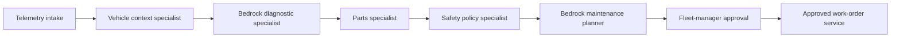

# FleetFix Command Center

FleetFix is a production-grade fleet-maintenance product that turns vehicle telemetry and diagnostic trouble codes into evidence-based, approval-controlled maintenance cases. It uses **LangGraph** to coordinate specialized agents and **Amazon Bedrock** for structured diagnosis and maintenance planning.

The product does not automatically create work orders. Safety policy and human authorization remain deterministic controls outside the model.

## Workflow



LangGraph compiles this five-node workflow into a typed state graph. AgentCore supports LangGraph-based tracing and evaluations when instrumented with OpenTelemetry. [AgentCore Evaluations](https://docs.aws.amazon.com/bedrock-agentcore/latest/devguide/evaluations.html)

## Production controls

- Real Bedrock Converse calls return Pydantic-validated diagnostics.
- JWT claims determine caller roles; body fields never grant authority in production.
- Vehicle context, parts, and work orders are approved HTTPS integration points.
- Critical DTC codes or engine temperature ≥115°C remove the vehicle from service.
- Work orders require fleet-manager/admin approval after the graph completes.
- DynamoDB stores cases; CloudWatch carries audit logs; Terraform provisions the foundation.

## Run locally

```bash
python3 -m venv .venv
source .venv/bin/activate
python -m pip install -e ".[dev]"
uvicorn app.main:app --reload --port 8080
```

Open `http://127.0.0.1:8080`. Development mode uses contract fixtures only. Production mode requires model access and the configuration described in `.env.example`; it fails closed if any required control is missing.

## Deploy

```bash
cd infra/terraform
cp terraform.tfvars.example terraform.tfvars
terraform init && terraform plan && terraform apply
```

Deploy the ARM64 container to AgentCore Runtime on port `8080`, expose it through AgentCore Gateway, and configure gateway-backed endpoints in the runtime environment. AgentCore Runtime’s HTTP protocol uses `POST /invocations`; use `GET /ping` for health checks. [Runtime protocol](https://docs.aws.amazon.com/bedrock-agentcore/latest/devguide/runtime-http-protocol-contract.html)

Before releasing, run the [golden evaluation dataset](evaluations/golden_dataset.jsonl) and the [readiness runbook](docs/runbooks/production-readiness.md).

## Tests

```bash
python -m pytest -q
```

The suite verifies agent ordering, safety escalation, approval boundaries, and API response headers.
